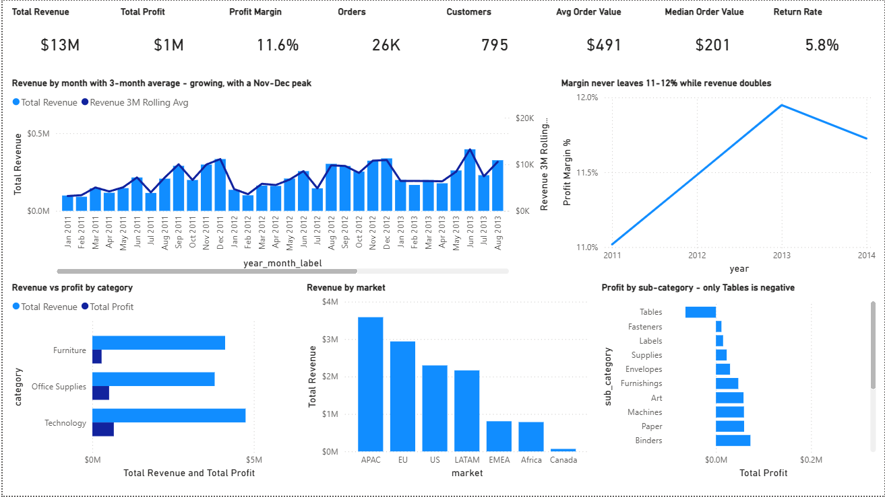
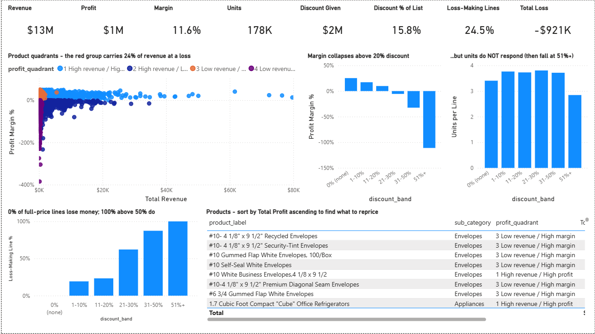
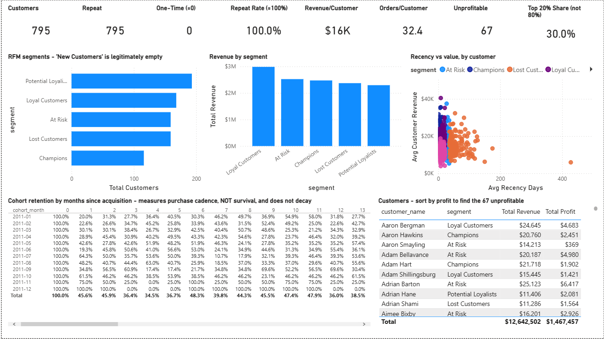
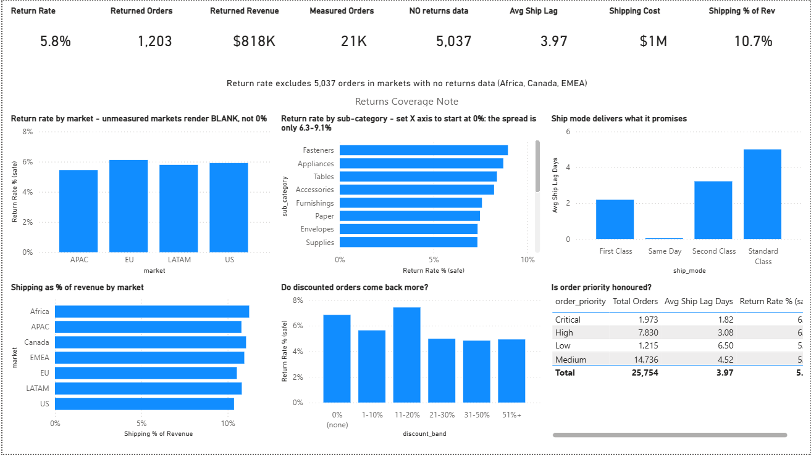

# E-Commerce Analytics Dashboard

**End-to-end retail analytics on the real Tableau Global Superstore dataset - Python cleaning pipeline, portable SQL analysis, RFM segmentation, cohort analysis, 14 visualisations, and a Power BI project that exposes where growth is profitable and where it is being bought with discount.**

<p align="center">
  
  
  
  
</p>



---

## Table of Contents

1. [Project Overview](#1-project-overview)
2. [The Business Problem](#2-the-business-problem)
3. [Dataset](#3-dataset)
4. [Project Architecture](#4-project-architecture)
5. [Tools Used](#5-tools-used)
6. [Analysis Workflow](#6-analysis-workflow)
7. [Data Quality Audit](#7-data-quality-audit)
8. [Python Skills Demonstrated](#8-python-skills-demonstrated)
9. [SQL Skills Demonstrated](#9-sql-skills-demonstrated)
10. [Power BI Skills Demonstrated](#10-power-bi-skills-demonstrated)
11. [Business Insights & Recommendations](#11-business-insights--recommendations)
12. [The Analytical Catch: Discounting Buys No Volume](#12-the-analytical-catch-discounting-buys-no-volume)
13. [Limitations & Honest Caveats](#13-limitations--honest-caveats)
14. [How to Reproduce](#14-how-to-reproduce)
15. [Future Improvements](#15-future-improvements)
16. [Resume Bullet Points](#16-resume-bullet-points)

---

## 1. Project Overview

A global retailer generated **$12.64M revenue** from **51,290 order lines** across **147 countries** between **2011 and 2014**. Revenue nearly doubled over four years, but profit margin stayed trapped around **11%-12%**. This project answers the executive question behind the dashboard: *is growth creating value, or just moving more discounted volume through the system?*

| Stage | What happens | Deliverable |
|-------|-------------|-------------|
| **Inspect** | Profile all sheets and quantify defects before changing data | `reports/data_quality_report.md` |
| **Clean** | Resolve customer identities, build reliable order keys, preserve revenue | `src/data_cleaning.py` |
| **Engineer** | Create margin, cost, list revenue, discount, fulfilment and monthly KPI features | `src/feature_engineering.py` |
| **Segment** | Build RFM segments and cohort retention, including degeneracy warnings | `src/rfm_analysis.py` |
| **Model** | Generate a verified star schema for BI | `dashboard/build_star_schema.py` |
| **Analyse** | Execute business queries across sales, products, customers and operations | `sql/` |
| **Visualise** | Produce 14 Python figures and a 4-page Power BI project | `reports/figures/`, `dashboard/` |
| **Verify** | Recompute all published claims and execute the SQL layer | `src/verify_claims.py` |

**The headline numbers**

| KPI | Value |
|-----|------:|
| Total revenue | **$12,642,501.91** |
| Total profit | **$1,467,457.29** |
| Profit margin | **11.61%** |
| Order lines / orders | **51,290 / 25,754** |
| Customers / products | **795 / 10,292** |
| Countries / markets / regions | **147 / 7 / 13** |
| Units sold | **178,312** |
| Average / median order value | **$490.89 / $201.30** |
| Discount given | **$2,363,988.32** |
| Loss-making order lines | **12,544** (24.46%) |
| Return rate | **5.81%** in measured markets only |
| Verification | **178 checks, 0 failures** |

---

## 2. The Business Problem

The company is growing, but top-line growth can hide margin leakage. Leadership needs to know:

1. **Is revenue growth healthy?** Revenue increased 90%, but margin barely moved.
2. **Which categories and products create profit, not just sales?**
3. **Do discounts increase demand, or only destroy margin?**
4. **Which customers are genuinely valuable, and does the 80/20 rule apply?**
5. **Are returns and fulfilment operational hotspots?**
6. **Which business assumptions are unsupported by the dataset?**
7. **What should the business do first?**

The final answer is not "sell more." It is: **control discounting, fix one loss-making sub-category, review 1,380 high-revenue loss-making products, and stop treating unmeasured return markets as zero-return markets.**

---

## 3. Dataset

**File:** `data/raw/Global Superstore.xls` - real Tableau Global Superstore workbook, unmodified.

**Source:** a complete three-sheet copy of the Tableau Global Superstore training dataset. Full sourcing and rejection notes for two inferior copies are documented in [`PROJECT_PROVENANCE.txt`](PROJECT_PROVENANCE.txt).

| Sheet | Rows x Cols | Contents |
|-------|------------:|----------|
| `Orders` | 51,290 x 24 | Sales, profit, discount, shipping cost, dates, geography, product, customer |
| `Returns` | 1,173 x 3 | Return flags by order and market |
| `People` | 13 x 2 | Regional managers |

**Grain:** one row per order line. `Row ID` is unique across all 51,290 lines. Order analysis uses a composite key because raw `order_id` is reused.

### Column groups

| Group | Columns |
|-------|---------|
| **Identity** | `row_id`, `order_id`, resolved `order_key`, resolved `customer_key`, `product_id` |
| **Dates** | `order_date`, `ship_date`, derived date parts, `ship_lag_days` |
| **Customer** | `customer_id`, `customer_name`, `segment`, first/last order, RFM scores |
| **Geography** | `city`, `state`, `country`, `market`, `region`, regional manager |
| **Product** | `category`, `sub_category`, `product_name`, derived `brand` |
| **Commercials** | `revenue`, `profit`, `cost`, `quantity`, `discount`, `list_revenue`, `discount_amount`, `margin` |
| **Operations** | `ship_mode`, `order_priority`, return flag, return coverage flag |

Nothing was synthesised. Because the workbook contains real `profit`, cost is derived exactly as `revenue - profit`; margin analysis is measured, not modelled.

---

## 4. Project Architecture

```
ecommerce-analytics/
|
+-- data/
|   +-- raw/
|   |   +-- Global Superstore.xls              real source, 3 sheets, unmodified
|   +-- processed/
|       +-- orders_clean.csv                   51,290 x 30 validated order lines
|       +-- orders_features.csv                51,290 x 48 derived analysis table
|       +-- orders_agg.csv                     25,754 real orders
|       +-- customers.csv                      795 resolved customers
|       +-- customer_metrics.csv               customer-level commercial metrics
|       +-- products.csv                       10,292 products
|       +-- monthly_kpis.csv                   48 gapless months
|       +-- rfm_segments.csv                   scores, segment, action, caveat
|       +-- cohort_retention.csv               retention matrix
|
+-- src/
|   +-- data_cleaning.py                       audit, identity resolution, returns join
|   +-- feature_engineering.py                 commercial and operational features
|   +-- rfm_analysis.py                        RFM, cohorts, degeneracy report
|   +-- verify_claims.py                       178 assertions + SQL execution
|
+-- sql/
|   +-- 00_schema.sql                          DDL, indexes, returns coverage dimension
|   +-- sales_analysis.sql                     growth, margin, market and seasonality
|   +-- product_analysis.sql                   quadrants, brands, discount-driven loss
|   +-- customer_analysis.sql                  top customers, RFM, cohorts
|   +-- operations_analysis.sql                returns, fulfilment, shipping
|
+-- dashboard/
|   +-- build_star_schema.py                   creates verified model inputs
|   +-- build_pbip.py                          generates Power BI Project files
|   +-- EcommerceAnalytics.pbip                Power BI project entrypoint
|   +-- EcommerceAnalytics.SemanticModel/      TMDL semantic model
|   +-- EcommerceAnalytics.Report/             PBIR report definition
|   +-- data/                                  7 model tables + manifest
|   +-- measures.dax                           DAX measures
|   +-- DASHBOARD_SPEC.md                      page and visual specification
|
+-- notebooks/
|   +-- ecommerce_analysis.ipynb               executed notebook with outputs
|   +-- build_notebook.py                      regenerates the notebook
|
+-- reports/
|   +-- business_insights.md                   executive report
|   +-- data_quality_report.md                 data audit
|   +-- verification_report.md                 178 PASS / 0 FAIL
|   +-- figures/                               14 analysis charts + 4 dashboard pages
|
+-- PROJECT_PROVENANCE.txt
+-- requirements.txt
+-- README.md
```

**Data flow**

```
Global Superstore.xls
   |
   +-- Python audit + cleaning ----> data_quality_report.md
   |          |
   |          +-- orders_clean.csv
   |          +-- orders_features.csv
   |
   +-- Feature engineering --------> monthly_kpis.csv, products.csv, customer_metrics.csv
   |
   +-- RFM + cohort analysis ------> rfm_segments.csv, cohort_retention.csv
   |
   +-- Portable SQL layer ---------> 35 business queries, executed by verify_claims.py
   |
   +-- Star schema build ----------> dashboard/data/*.csv, model_manifest.json
   |
   +-- Power BI project build -----> EcommerceAnalytics.pbip + 4 report pages
```

---

## 5. Tools Used

| Tool | Used for |
|------|----------|
| **Python 3.14** | Pipeline orchestration, cleaning, feature engineering, verification |
| **Pandas** | Profiling, transformations, grouped analysis, reconciliation |
| **NumPy** | Vectorised feature creation and banding |
| **SciPy** | Spearman correlations and retention trend testing |
| **Matplotlib / Seaborn** | 14 analysis charts |
| **xlrd** | Reading the legacy `.xls` source workbook |
| **Jupyter** | Executed narrative notebook |
| **SQLite 3.50.4** | SQL execution and independent verification |
| **Portable ANSI SQL** | Cross-database analytical query layer |
| **Power BI PBIP / TMDL / PBIR** | Semantic model and four-page report project |
| **DAX** | BI measures, including coverage-aware return rate and inactive date relationship measures |

---

## 6. Analysis Workflow

1. **Inspect** - profile all three source sheets, row counts, types, nulls and keys.
2. **Validate** - check date logic, numeric ranges, duplicate lines, product identity and returns coverage.
3. **Clean** - resolve customer identity, build composite order keys, normalise return markets and preserve all rows.
4. **Engineer** - compute exact cost, margin, list revenue, discount amount, order/customer/monthly aggregates.
5. **Segment** - build RFM scores, customer actions and cohort retention with explicit caveats.
6. **Analyse** - answer business questions in SQL and reproduce the same conclusions in Python.
7. **Model** - build a star schema and Power BI semantic model with referential integrity checks.
8. **Visualise** - create analysis charts and dashboard pages for executives, products, customers and operations.
9. **Verify** - assert every headline number and execute every SQL file before publishing.

---

## 7. Data Quality Audit

Full detail in [`reports/data_quality_report.md`](reports/data_quality_report.md).

### The honest headline: real structural defects, not trivial dirt

| Check | Result |
|-------|--------|
| Exact duplicate rows | **0** |
| Invalid negative revenue / quantity / shipping | **0** |
| Zero-quantity lines | **0** |
| Unparseable dates | **0** |
| Ship date before order date | **0** |
| Missing values | Only `postal_code`, structurally absent outside US |
| Rows dropped | **0** |
| Revenue/profit/quantity changed | **No** |

The important cleaning work was not deleting rows. It was fixing four defects that would have corrupted the analysis while still looking plausible.

| # | Defect | Fix | Why it matters |
|---|--------|-----|----------------|
| 1 | Every customer name appears under exactly two customer IDs | Resolve to `customer_key`, preserve raw IDs | Prevents reporting 1,590 customers instead of 795 |
| 2 | 659 `order_id`s are reused across customers and dates | Use `(order_id, customer_id, order_date)` | Prevents overstating average order value by 2.87% |
| 3 | Discount has float noise and real 3-decimal tiers | Round to 3 decimals, not 2 | Keeps 629 real tiered-discount lines |
| 4 | Returns cover only APAC, EU, LATAM and US, with `United States` vs `US` label mismatch | Normalise market and join on `(order_id, market)` | Prevents false returns and avoids treating unmeasured markets as 0% returns |

**Reconciliation:** rows 51,290 -> 51,290. Revenue $12,642,501.91 -> $12,642,501.91. Profit $1,467,457.29 -> $1,467,457.29. Quantity 178,312 -> 178,312. Cleaning added reliable analytical structure; it did not rewrite the business.

---

## 8. Python Skills Demonstrated

| Skill | Where | Note |
|-------|-------|------|
| Defensive workbook ingest | `data_cleaning.py` | Reads legacy `.xls` and all three source sheets |
| Assertion-driven cleaning | `data_cleaning.py` | 8 reconciliation checks ensure no revenue, profit, quantity or rows drift |
| Key-resolution logic | `data_cleaning.py` | Resolves customer identity and composite order identity |
| Coverage-aware joins | `data_cleaning.py` | Joins returns only where coverage exists |
| Feature engineering | `feature_engineering.py` | Cost, margin, discount amount, ship lag, monthly KPI fields |
| Statistical testing | notebook / `verify_claims.py` | Spearman correlations and retention trend p-value |
| RFM segmentation | `rfm_analysis.py` | Segments include real R/F/M ranges and label caveats |
| Cohort analysis | `rfm_analysis.py` | Shows why cohort retention is weak for this closed panel |
| Matplotlib / Seaborn visualisation | notebook | 14 charts tied to business questions |
| Notebook generation | `build_notebook.py` | Rebuilds executed analysis narrative |
| Automated verification | `verify_claims.py` | 178 assertions, including SQL-vs-pandas cross-checks |

---

## 9. SQL Skills Demonstrated

| Technique | Where | Business purpose it serves |
|-----------|-------|----------------------------|
| DDL and indexing | `00_schema.sql` | Creates a reusable analytical table with practical indexes |
| Portable date handling | all SQL files | Uses precomputed date parts so SQL runs on SQLite, MySQL, PostgreSQL and DuckDB |
| KPI aggregation | `sales_analysis.sql` | Revenue, profit, cost, margin, orders, customers and units |
| Monthly and yearly trend analysis | `sales_analysis.sql` | Growth, seasonality and margin stability |
| Discount-band analysis | `sales_analysis.sql` | Identifies the 20% profitability threshold |
| Product quadrants | `product_analysis.sql` | Separates healthy revenue from loss-scaling products |
| Window functions | `product_analysis.sql`, `customer_analysis.sql` | Ranking, cumulative revenue and RFM scoring |
| CTEs | all analysis files | Keeps multi-step analytical questions readable |
| Coverage-aware returns | `operations_analysis.sql` | Computes return rate only for measured markets |
| SQL-vs-Python verification | `verify_claims.py` | 26 cross-checks prove the SQL layer agrees with pandas |

**35 queries across 5 SQL files are executed, not just written.** `src/verify_claims.py` runs 50 SQL statements, loads 51,290 rows, and confirms the SQL results agree with the Python pipeline.

---

## 10. Power BI Skills Demonstrated

The dashboard project is generated under [`dashboard/`](dashboard/).

| Artefact | Status |
|----------|--------|
| `dashboard/data/*.csv` | **Built and verified** - 12/12 integrity checks pass |
| `dashboard/data/model_manifest.json` | **Generated** - table sizes, relationships, integrity results |
| `dashboard/measures.dax` | **Authored** - commercial, product, customer, return and fulfilment measures |
| `dashboard/EcommerceAnalytics.pbip` | **Generated** - Power BI Project entrypoint |
| `EcommerceAnalytics.SemanticModel/` | **Generated** - TMDL semantic model |
| `EcommerceAnalytics.Report/` | **Generated** - PBIR report with four pages |
| `reports/figures/dashboard_*.png` | **Exported screenshots** of the four dashboard pages |

### Dashboard pages

| Page | Screenshot | Purpose |
|------|------------|---------|
| Executive Overview |  | Top-line revenue, profit, margin, discount and growth |
| Sales & Product Analysis |  | Category, sub-category, market and product profitability |
| Customer Analytics |  | RFM segments, concentration and customer economics |
| Operations & Returns |  | Coverage-aware returns, shipping cost and fulfilment lag |

**Important modelling choices**

- `fact_sales` is one row per order line, not one row per order.
- `dim_customer` uses the resolved customer key, so the model counts 795 people, not 1,590 raw IDs.
- `Total Orders` must count the composite `order_key`, not reused `order_id`.
- `dim_returns_coverage` prevents Africa, Canada and EMEA from appearing as 0% return markets when returns were never recorded there.
- The ship-date relationship is inactive and should be activated only in fulfilment measures.

---

## 11. Business Insights & Recommendations

Every number below is verified in [`reports/verification_report.md`](reports/verification_report.md). Full narrative: [`reports/business_insights.md`](reports/business_insights.md).

### 1. Growth is real, but unit economics are flat

| Year | Revenue | Profit | Margin | Growth |
|------|--------:|-------:|-------:|-------:|
| 2011 | $2,259,451 | $248,941 | 11.02% | - |
| 2012 | $2,677,439 | $307,415 | 11.48% | +18.5% |
| 2013 | $3,405,746 | $406,935 | 11.95% | +27.2% |
| 2014 | $4,299,866 | $504,166 | 11.73% | +26.3% |

Revenue grew **90.31%** over four years and every month was profitable, but margin never escaped the 11%-12% band. Scale did not improve unit economics.

### 2. Discounting is the central profit leak

| Discount band | Lines | Avg units/line | Margin | Loss-making lines |
|---------------|------:|---------------:|-------:|------------------:|
| 0% | 29,009 | 3.40 | **+25.3%** | **0.0%** |
| 1-10% | 4,679 | 3.76 | +17.2% | 19.3% |
| 11-20% | 6,274 | 3.73 | +9.9% | 23.3% |
| 21-30% | 967 | 3.81 | **-5.5%** | 62.2% |
| 31-50% | 6,189 | 3.72 | -32.4% | 87.4% |
| 51%+ | 4,172 | **2.84** | **-111.0%** | **100.0%** |

Discounts above 20% carry **$1.93M revenue** at **-$814.7K profit**. Spearman correlation between discount and quantity is only **+0.018**, so discount is not buying meaningful volume.

### 3. 1,380 products are scaling a loss

| Quadrant | Products | Revenue | Profit | Avg discount |
|----------|---------:|--------:|-------:|-------------:|
| High revenue / high profit | 3,766 | $8,660,218 | $1,844,902 | 10.7% |
| **High revenue / low profit** | **1,380** | **$3,037,191** | **-$461,720** | **23.0%** |
| Low revenue / high margin | 3,595 | $690,157 | $166,853 | 10.1% |
| Low revenue / low profit | 1,551 | $254,937 | -$82,577 | 35.5% |

This is the dangerous product group: high sales volume, negative profit, and **2.15x** the discount rate of healthy high-revenue products.

### 4. Geography is not the problem

All **13 regions** and all **7 markets** are profitable. There is no evidence for exiting a region. The actual weak spots are thin margins, especially **Southeast Asia at 2.02%** and **EMEA at 5.45%**.

Only one sub-category is loss-making: **Tables**, at **-$64,083** on **$757,042** revenue.

### 5. The 80/20 rule does not hold

| Metric | Value |
|--------|------:|
| Customers | 795 |
| Gini coefficient | **0.180** |
| Top 20% share of revenue | **30.04%** |
| Unprofitable customers | **67** |
| Lifetime revenue range | $3,892-$40,488 |

There is no whale segment carrying the business. Customer strategy should not be built around defending a top 20% that only holds 30% of revenue.

### 6. RFM and cohort retention need careful interpretation

This is a closed customer panel. Every customer placed at least **15 orders**, all customers were first observed in **2011**, and only **1 customer** is dormant beyond 180 days. That makes common ecommerce metrics degenerate:

| Metric | Value | Interpretation |
|--------|------:|----------------|
| One-time customers | 0 | None exist in this extract |
| Repeat purchase rate | 100% | A property of the dataset, not a win |
| New customers after 2011 | 0 | Acquisition cannot be analysed |
| Mean monthly retention | 43.76% | Purchase cadence, not survival |
| Retention trend | -0.21pp/month, p=0.09 | No significant decay |

RFM segment labels are relative positions inside the closed panel, not literal churn states.

### 7. Returns and fulfilment have no hotspot

Return rate is **5.81%** over measured markets only: APAC, EU, LATAM and US. Africa, Canada and EMEA have no return records, so their return rate is **unknown**, not 0%.

Where returns are measured, they are uniform: **5.44%-6.11%** by market and **6.33%-9.10%** by sub-category. Fulfilment behaves as expected by ship mode, with order-to-ship lag from **0 to 7 days**.

### Priority summary

| Priority | Action | Evidence | Why first |
|----------|--------|----------|-----------|
| **P0** | Cap discounts at 20% | Above-20% bands carry $1.93M revenue at -$815K profit | Largest identifiable profit lever |
| **P0** | Run a controlled discount test | Discount-quantity rho = +0.018 | Converts correlation into decision evidence |
| **P1** | Review 1,380 high-revenue loss-making products | $3.04M revenue, -$462K profit | Stops scaling loss |
| **P1** | Fix Tables | Only loss-making sub-category | Clear, contained category action |
| **P1** | Review Southeast Asia and EMEA margins | 2.02% and 5.45% margin | Margin issue, not footprint issue |
| **P2** | Put 67 unprofitable customers on commercial review | 8.4% of customers lose money lifetime | Adjust terms, shipping recovery and discounts |
| **P2** | Treat returns as a priced-in cost | No category or market hotspot | Avoids chasing noise |
| **P3** | Instrument missing fields | Payment, cancellation, delivery, return reasons absent | Makes the next analysis answerable |

---

## 12. The Analytical Catch: Discounting Buys No Volume

The tempting retail assumption is simple: *discounts increase units, and the extra volume pays for the margin loss.*

This data says otherwise.

| Test | Result |
|------|--------|
| Discount vs quantity correlation | **+0.018** |
| Discount vs margin correlation | **-0.669** |
| Full-price loss-making lines | **0.0%** |
| 51%+ discount loss-making lines | **100.0%** |
| Units at full price | **3.40 per line** |
| Units at 51%+ discount | **2.84 per line** |

The deepest discounts do not bring the largest baskets. They bring **smaller** baskets and guaranteed losses. The profitability crossover appears between **11-20%** and **21-30%** discount.

That changes the recommendation. The right action is not a blanket product delisting or regional retreat. It is to separate products that are bad economics from products made bad by discount policy. `sql/product_analysis.sql` query P8 isolates products that lose money overall but are profitable at full price; those need discount withdrawal, not removal.

---

## 13. Limitations & Honest Caveats

Stating these is part of the analysis.

1. **Association, not causation.** Discounts correlate with lower margins and not with quantity, but the dataset alone cannot prove that removing discounts recovers the full loss. That is why the first action is a controlled test.
2. **Shipping-cost ambiguity remains unresolved.** The extract does not say whether `shipping_cost` is already deducted inside `profit`. Shipping is reported separately and never double-counted in headline profit.
3. **Currency is assumed consistent.** The workbook spans 147 countries but has no currency column.
4. **Returns coverage is incomplete.** Africa, Canada and EMEA have no return records; their return rate is unknown.
5. **No payment method field.** Payment-method analysis cannot be performed.
6. **No order status field.** Cancellation rate cannot be measured.
7. **No delivery date.** The project measures order-to-ship lag, not final delivery time.
8. **No return reasons.** Returns can be counted, not diagnosed.
9. **No customer demographics.** Gender and age analysis would be invented.
10. **Closed customer panel.** Acquisition, true churn and forecast modelling are not supported.
11. **Derived brand is imperfect.** Brand comes from the first token of `product_name`; useful in aggregate, not a perfect source field.
12. **SQL was executed on SQLite.** The SQL is written in portable ANSI form and should run on MySQL/PostgreSQL/DuckDB, but the verified execution engine here is SQLite 3.50.4.

---

## 14. How to Reproduce

**Prerequisites:** Python 3.11+ recommended. Power BI Desktop is required only to open or edit the `.pbip` dashboard.

```bash
pip install -r requirements.txt

# 1. Build the analytical data
python src/data_cleaning.py
python src/feature_engineering.py
python src/rfm_analysis.py

# 2. Verify all published claims and execute the SQL layer
python src/verify_claims.py

# 3. Rebuild the BI model inputs
python dashboard/build_star_schema.py

# 4. Rebuild the Power BI project files
python dashboard/build_pbip.py

# 5. Optional: regenerate the executed notebook
python notebooks/build_notebook.py
```

Expected verification result:

```text
178 PASS / 0 FAIL
50 SQL statements executed
26 SQL-vs-pandas cross-checks passed
```

To run the SQL manually against another database, load `data/processed/orders_features.csv` into the schema from `sql/00_schema.sql`, then execute the four analysis files in order.

---

## 15. Future Improvements

| Improvement | Why it matters |
|-------------|----------------|
| **Controlled discount experiment** | Turns the central correlation into causal evidence |
| **Payment and order-status capture** | Unlocks payment mix, cancellation rate and order-funnel analysis |
| **Delivery dates and late-delivery flag** | Separates fulfilment speed from shipping speed |
| **Return reasons** | Converts return rate from monitoring into root-cause analysis |
| **Market-level return coverage** | Stops Africa, Canada and EMEA from remaining unknown |
| **External cost and shipping rules** | Resolves whether shipping is already included in profit |
| **True customer acquisition data** | Makes cohort retention and churn modelling meaningful |
| **Forecasting after more periods** | Four years of a closed panel is too thin for reliable forecasting |
| **DAX engine validation** | Confirms authored measures inside Power BI beyond CSV-level reconciliation |
| **Automated refresh pipeline** | Moves the project from portfolio build to scheduled reporting |

---

## 16. Resume Bullet Points

**Impact-first**

- Analysed the real Tableau Global Superstore dataset with **51,290 order lines**, **25,754 orders**, **795 resolved customers** and **$12.64M revenue**, identifying that revenue grew **90.31%** while profit margin stayed flat at roughly **11%-12%**.
- Built a full **Python + SQL + Power BI** analytics pipeline covering data cleaning, feature engineering, RFM segmentation, cohort retention, portable SQL analysis, dimensional modelling and executive dashboard delivery.
- Found that **$2.36M of discount** bought almost no incremental volume (**rho = +0.018**) while pushing every order line above 50% discount into loss, making discount governance the highest-value profit lever.
- Resolved four structural data defects that would have corrupted the analysis: duplicated customer identities, reused order IDs, discount precision artifacts and incomplete returns coverage.
- Wrote and executed business SQL queries across sales, product, customer and operations analysis, then cross-verified SQL outputs against pandas with **178 automated checks and 0 failures**.
- Built a Power BI project with a verified star schema, DAX measures, coverage-aware return-rate logic and four report pages: Executive Overview, Sales & Product Analysis, Customer Analytics, and Operations & Returns.

**Concise**

- Built an end-to-end ecommerce analytics project on **51,290 Global Superstore order lines** using Python, SQL and Power BI.
- Identified **$2.36M in discount leakage** with no meaningful volume response and **$815K negative profit** in discount bands above 20%.
- Corrected customer and order key defects that would have doubled customer count and overstated AOV.
- Produced RFM, cohort, product, region, return and fulfilment analysis with **178 verified checks** and SQL-vs-pandas reconciliation.
- Delivered a four-page Power BI project and executive recommendations focused on discount caps, product review and returns instrumentation.

**Interview talking points**

1. **The discount finding.** The business is growing, but discounts are not buying volume; they are destroying margin.
2. **The key-quality fixes.** `customer_id` and `order_id` both look usable and both are wrong unless resolved.
3. **Why returns are coverage-aware.** Missing return records for a market are not the same as zero returns.
4. **Why the 80/20 rule failed.** Top 20% of customers hold only 30% of revenue, so customer-tier strategy is not the main lever.
5. **Why cohort retention is caveated.** The dataset is a closed panel, so retention charts mostly measure purchase cadence.
6. **Why verification matters.** The automated gate caught seven narrative errors before publication, including two that would have become wrong recommendations.

---

<div align="center">

**Built as a portfolio project demonstrating end-to-end ecommerce analytics: data quality auditing, pipeline engineering, SQL analysis, customer segmentation, Power BI modelling, business scepticism and executive reporting.**

*Every headline number in this README is reproducible from the scripts in this repository.*

</div>

## Final README Update`r`nThis release candidate reflects the final ecommerce analytics presentation package.


## Final Delivery Checkpoint`r`nThis repository is ready for public GitHub delivery with a complete evidence trail and final dashboard documentation.

